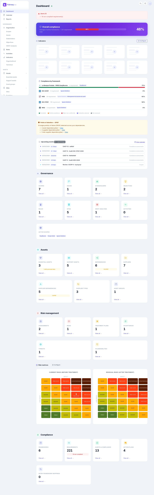

# Cairn

Open-source **Governance, Risk and Compliance** (GRC) platform.

Manage your organisation's security posture, track compliance with regulatory frameworks (ISO 27001, GDPR, NIS2, ...), and run structured risk assessments (ISO 27005, EBIOS RM) - all from a single, self-hosted application.



## What you get

- **Governance** : organisational scopes, sites, strategic issues, stakeholders, objectives, SWOT, roles and activities
- **Assets** : essential and support assets with CIA valuation, dependencies, SPOF detection and a supplier registry
- **Risks** : ISO 27005 and EBIOS RM (ANSSI v1.5, workshops 0 to 5) assessments, threat and vulnerability catalogs, treatment plans and formal risk acceptance
- **Compliance** : frameworks, requirements, assessments, findings, action plans and inter-framework mappings, with Excel import
- **Steering** : real-time dashboard (risk matrices and a current-to-residual risk treatment flow chart), KPI indicators, ISO 27001 management reviews, and PDF/DOCX/PPTX report generation (SoA, audit report, risk register, meeting minutes)
- **Ask Cairn (optional)** : natural-language questions in the command palette ("Which decisions were made at the last management review?"), answered by a pluggable LLM provider (Mistral AI by default; OpenAI / any OpenAI-compatible endpoint; Claude; self-hosted Ollama) that cites real records and enforces your permissions, with thumbs up/down feedback that admins can export to improve the assistant

Everything is bilingual (English/French), audit-ready (full change history, versioning, lifecycle workflows with approvals) and access-controlled (role-based permissions, scope-based tenancy, passkey login).

Beyond the web UI, every feature is also available through a [REST API](docs/api.md) and a built-in [MCP server](docs/mcp-server.md), so scripts and AI assistants can work with your GRC data directly.

## Quick start

With [Docker](https://docs.docker.com/get-docker/) installed:

```bash
cp .env.example .env
docker compose up --build
# in another terminal:
docker compose exec web python manage.py migrate
docker compose exec web python manage.py createsuperuser
```

Then open [http://localhost:8000](http://localhost:8000). To try Cairn with realistic sample content, load the [demo dataset](docs/installation.md#demo-data-optional).

To run the published image without cloning the repository, and for production notes (scheduled commands), see the [installation guide](docs/installation.md).

## Documentation

| Document | Contents |
| -------- | -------- |
| [Installation guide](docs/installation.md) | Docker setup (from source or published image), scheduled commands |
| [Features](docs/features.md) | Detailed feature reference for every module |
| [REST API](docs/api.md) | Base paths, authentication, conventions |
| [MCP server](docs/mcp-server.md) | Endpoints, OAuth 2.0, full tool reference |
| [Module specifications](docs/modules/README.md) | Business rules and per-entity contracts |

## Tech stack

Django 5.2 LTS, PostgreSQL 16, Django REST Framework, Django Channels + Redis (real-time), Bootstrap 5.3 + HTMX + Apache ECharts (frontend), Docker. Optional: Mistral AI, OpenAI / OpenAI-compatible endpoints, Claude (Anthropic), or self-hosted Ollama (Ask Cairn assistant).

## Licence

MIT
