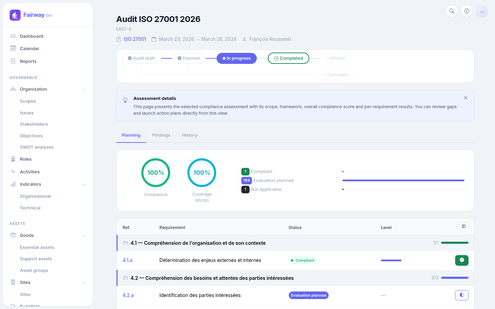
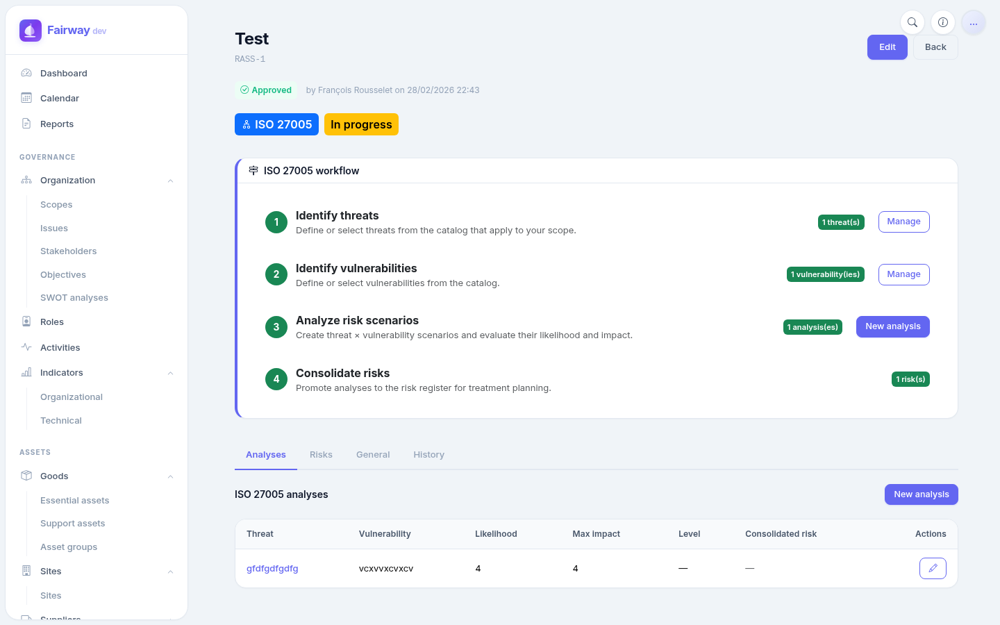
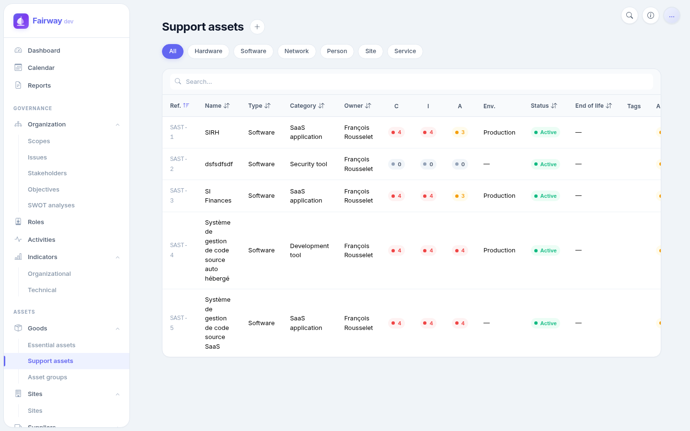
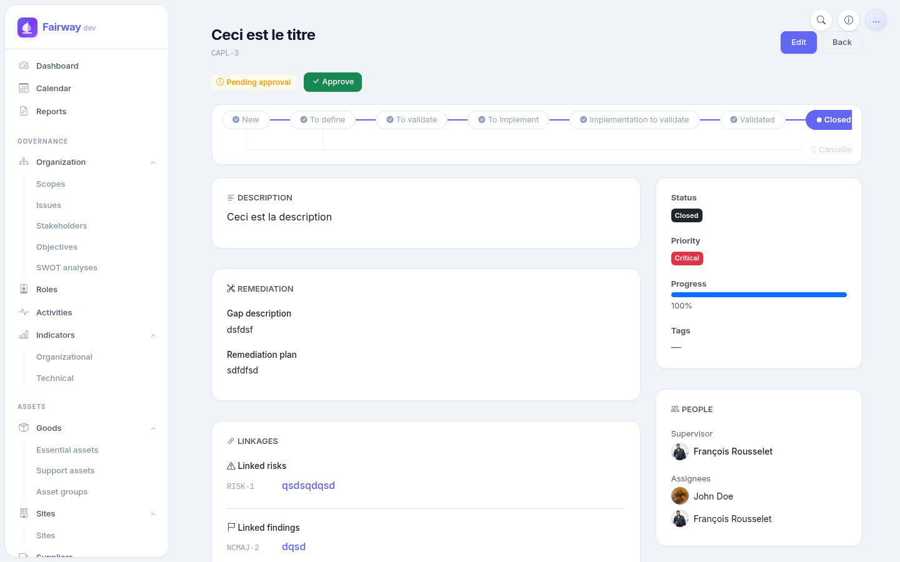

# Fairway

Open-source **Governance, Risk and Compliance** (GRC) platform built with Django.
Manage your organisation's security posture, track compliance with regulatory frameworks, and run structured risk assessments - all from a single, self-hosted application.

---

## Screenshots

| Dashboard | Compliance Assessment |
|:---------:|:---------------------:|
|  |  |

| Risk Assessment (ISO 27005) | Support Assets |
|:---------------------------:|:--------------:|
|  |  |

| Action Plan Detail |
|:------------------:|
|  |

---

## Features

### Governance (Context & Organisation)

| Feature | Description |
| ------- | ----------- |
| Scopes | Hierarchical organisational perimeters with versioning and approval workflow |
| Sites | Physical and logical locations (offices, datacenters, cloud regions) with hierarchy |
| Issues | Internal/external strategic issues (PESTLE categories) with impact and trend tracking |
| Stakeholders | Interested parties with expectations, influence/interest levels and RACI support |
| Objectives | Security and business objectives with KPI tracking (target/current values, progress %) |
| SWOT Analysis | Structured strengths/weaknesses/opportunities/threats with impact levels |
| Roles & Responsibilities | RACI matrix, mandatory role enforcement, responsibility assignments |
| Activities | Hierarchical business processes (core, support, management) with criticality levels |
| Tags | Reusable tags assignable to any domain object for cross-cutting classification |

### Asset Management

| Feature | Description |
| ------- | ----------- |
| Essential Assets | Business processes and information assets with DIC valuation (Confidentiality, Integrity, Availability on a 5-level scale) |
| Support Assets | IT infrastructure (hardware, software, network, services, sites, people) with lifecycle tracking (EOL, warranty) |
| Dependencies | Essential-to-support asset mapping with criticality, SPOF detection and redundancy tracking |
| Site Dependencies | Site-to-asset and site-to-supplier dependency tracking |
| Asset Groups | Logical grouping of support assets |
| DIC Inheritance | Support assets automatically inherit max DIC levels from linked essential assets |
| Valuations | Historical DIC evaluation tracking per essential asset |
| Suppliers | Supplier registry with types, contractual requirements, evidence reviews and dependency mapping |

### Risk Management

| Feature | Description |
| ------- | ----------- |
| Risk Assessments | ISO 27005 and EBIOS RM methodologies |
| Risk Criteria | Configurable likelihood/impact scales with dynamic risk matrix generation |
| Risks | Three-level tracking (initial, current, residual) with treatment decisions (accept, mitigate, transfer, avoid) |
| Threat Catalog | Reusable threats by type (deliberate, accidental, environmental) and origin |
| Vulnerability Catalog | Reusable vulnerabilities with severity, CVE references and remediation guidance |
| ISO 27005 Analysis | Atomic threat x vulnerability risk scenarios with combined likelihood/impact calculation |
| Treatment Plans | Structured remediation with ordered actions, progress tracking and cost estimates |
| Risk Acceptance | Formal acceptance records with expiry dates, conditions and review tracking |
| Risk Matrices | Visual heatmaps (current vs residual) |

### Compliance

| Feature | Description |
| ------- | ----------- |
| Frameworks | Regulatory and standard frameworks (ISO 27001, GDPR, NIS2, etc.) with type, category and jurisdiction |
| Sections | Hierarchical framework structure |
| Requirements | Per-framework requirements with compliance status, evidence and gap tracking |
| Assessments | Compliance evaluations with per-requirement results and automatic compliance level calculation |
| Findings | Audit findings (major/minor non-conformities, observations, opportunities, strengths) linked to assessments |
| Action Plans | Gap remediation plans with priority, progress, cost tracking and threaded comments |
| Inter-Framework Mappings | Requirement-to-requirement mappings across frameworks (equivalent, partial, includes, related) |
| Framework Import | Excel-based bulk import of frameworks and requirements |

### Users & Access Control

| Feature | Description |
| ------- | ----------- |
| Custom User Model | Email-based authentication with UUID primary keys |
| Role-Based Access Control | Granular permissions (90+) using `module.feature.action` codenames |
| 6 System Groups | Super Admin, Admin, RSSI/DPO, Auditor, Contributor, Reader |
| Scope-Based Tenancy | Groups can be restricted to specific organisational scopes |
| Account Security | Failed login lockout (5 attempts / 15 min), password complexity enforcement |
| Dual Authentication | Session-based (web UI) + JWT with token rotation (API) |
| Passkey Authentication | FIDO2 WebAuthn passwordless login with discoverable credentials |
| Access Logs | Full audit trail of authentication events (login, logout, lockout, password change) |

### Indicators (KPI Tracking)

| Feature | Description |
| ------- | ----------- |
| Custom Indicators | Manual KPI, metric and compliance metric tracking with number, boolean or percentage formats |
| Predefined Indicators | Auto-computed metrics (global compliance rate, risk treatment rate, objective progress, etc.) |
| Thresholds | Critical threshold detection with configurable operators and min/max bounds |
| Measurement History | Timestamped measurements with trend and delta tracking |
| Sparklines | Inline charts on the dashboard for numeric indicators |

### Platform Capabilities

| Feature | Description |
| ------- | ----------- |
| Real-Time Dashboard | WebSocket-powered live statistics via Django Channels with animated counters and auto-reconnect |
| Calendar & iCal | Unified calendar view across all modules with iCal subscription feed and per-user tokens |
| Global Search | Multi-category search across all domain objects |
| Reports | Configurable report generation with status tracking |
| Approval Workflows | Two-step approval (submit / approve) on all domain models with dedicated permissions |
| Audit Trail | Full change history on every model via django-simple-history |
| Versioning | Automatic version increment on all domain objects |
| Company Settings | Centralised platform configuration (organisation name, logo, defaults) |
| Bilingual UI | Full French/English interface with contextual help banners |
| Excel Export | Export assets, risks, compliance data to Excel |
| Dark Mode | Automatic theme switching based on OS preference |
| Responsive UI | Collapsible sidebar, mobile-friendly layout |
| REST API | Full CRUD + filtering, search, pagination and export on all resources |
| HTMX Integration | Dynamic partial updates without full page reloads |
| MCP Server | JSON-RPC 2.0 server with 50+ tools and OAuth 2.0 authentication for external clients |

---

## MCP Server (Model Context Protocol)

Fairway ships with a built-in JSON-RPC 2.0 MCP server exposing 53 tools across all modules. Authentication uses OAuth 2.0. All tools enforce RBAC permissions and scope-based tenancy.

### CRUD pattern

Most domain entities expose a standard set of operations generated automatically:

| Operation | Tool name pattern | Description |
| --------- | ----------------- | ----------- |
| List | `list_{entity}s` | Paginated list with search, filters, limit/offset |
| Get | `get_{entity}` | Get a single object by UUID |
| Create | `create_{entity}` | Create a new object |
| Update | `update_{entity}` | Update an existing object |
| Delete | `delete_{entity}` | Delete an object |
| Approve | `approve_{entity}` | Approve an object (where approval workflow applies) |

### Context module

| CRUD entity | Approve | Filters |
| ----------- | ------- | ------- |
| `scope` | Yes | type, status |
| `issue` | Yes | type, category |
| `stakeholder` | Yes | type, influence_level |
| `objective` | Yes | type, status |
| `role` | Yes | - |
| `activity` | Yes | type, criticality |
| `site` | Yes | type, status |
| `indicator` | Yes | indicator_type, status, format, collection_method |
| `indicator_measurement` | No | indicator_id |
| `responsibility` | No | role_id, raci_type |

Additional tools:

| Tool | Description |
| ---- | ----------- |
| `list_tags` | List all tags |
| `create_tag` | Create a tag |
| `delete_tag` | Delete a tag |

### Assets module

| CRUD entity | Approve | Filters |
| ----------- | ------- | ------- |
| `essential_asset` | Yes | type, category, status |
| `support_asset` | Yes | type, category, status |
| `asset_dependency` | Yes | essential_asset_id, support_asset_id, dependency_type, criticality |
| `site_asset_dependency` | Yes | support_asset_id, site_id, dependency_type, criticality |
| `site_supplier_dependency` | Yes | site_id, supplier_id, dependency_type, criticality |
| `asset_group` | Yes | type, status |
| `supplier` | Yes | type, criticality, status |
| `supplier_dependency` | Yes | support_asset_id, supplier_id |
| `asset_valuation` | No | essential_asset_id |
| `supplier_type` | No | - |
| `supplier_type_requirement` | No | supplier_type_id |
| `supplier_requirement` | No | supplier_id, compliance_status |
| `supplier_requirement_review` | No | supplier_requirement_id, result |

Additional tools:

| Tool | Description |
| ---- | ----------- |
| `update_supplier_logo` | Upload a logo via base64 data URI or public URL with automatic variant generation (128/64/32/16px) |

### Compliance module

| CRUD entity | Approve | Filters |
| ----------- | ------- | ------- |
| `framework` | Yes | type, category, status |
| `section` | No | framework_id, parent_section_id |
| `requirement` | Yes | framework_id, section_id, compliance_status, type, priority |
| `compliance_assessment` | Yes | status |
| `assessment_result` | No | assessment_id, requirement_id, compliance_status |
| `requirement_mapping` | No | source_requirement_id, target_requirement_id, mapping_type |
| `action_plan` | Yes | status, priority |
| `finding` | No | assessment_id, finding_type |

Additional tools:

| Tool | Description |
| ---- | ----------- |
| `get_framework_compliance_summary` | Compliance summary with section-level scores and status distribution |
| `action_plan_transition` | Transition an action plan through the Kanban workflow (forward, refusal, cancellation) |
| `action_plan_transitions` | List transition history for an action plan |
| `action_plan_kanban` | Get action plans grouped by status for Kanban board with workflow rules |
| `action_plan_allowed_transitions` | Get allowed transitions for an action plan with permission checks |
| `list_action_plan_comments` | List threaded comments on an action plan |
| `create_action_plan_comment` | Create a comment or reply on an action plan |

### Risks module

| CRUD entity | Approve | Filters |
| ----------- | ------- | ------- |
| `risk_assessment` | Yes | status |
| `risk_criteria` | No | status |
| `scale_level` | No | criteria_id, scale_type |
| `risk_level` | No | criteria_id, requires_treatment |
| `risk` | Yes | status, priority, assessment_id |
| `risk_treatment_plan` | Yes | status, risk_id |
| `treatment_action` | No | treatment_plan_id, status |
| `risk_acceptance` | No | risk_id, status |
| `threat` | Yes | type, status |
| `vulnerability` | Yes | category, severity, status |
| `iso27005_risk` | No | assessment_id, threat_id, vulnerability_id |

Additional tools:

| Tool | Description |
| ---- | ----------- |
| `list_risk_requirements` | List compliance requirements linked to a risk |
| `list_requirement_risks` | List risks linked to a compliance requirement |
| `link_risk_requirements` | Link requirements to a risk (additive) |
| `unlink_risk_requirements` | Remove requirement links from a risk |
| `set_risk_requirements` | Replace all linked requirements on a risk |

### Accounts module

| Tool | Description |
| ---- | ----------- |
| `list_users` | List users with search and active status filter |
| `get_user` | Get detailed user information |
| `get_me` | Get the currently authenticated user |
| `list_groups` | List all groups |
| `get_group` | Get group details including permissions |
| `list_permissions` | List all available permissions with module filter |
| `list_access_logs` | List authentication events (login, logout, lockout) |

### Reports & Settings

| Tool | Description |
| ---- | ----------- |
| `list_reports` | List generated reports with optional type filter |
| `generate_soa_report` | Generate a Statement of Applicability (SoA) PDF for selected frameworks |
| `generate_audit_report` | Generate an audit report PDF for a completed assessment |
| `delete_report` | Delete a generated report |
| `get_company_settings` | Get company settings (name, address) |
| `update_company_settings` | Update company settings |

---

## Tech Stack

| Component | Technology |
| --------- | ---------- |
| Backend | Django 5.2 LTS |
| Database | PostgreSQL 16 |
| Real-Time | Django Channels + Redis 7 |
| ASGI Server | Uvicorn |
| REST API | Django REST Framework |
| Authentication | djangorestframework-simplejwt, fido2 (WebAuthn) |
| Audit Trail | django-simple-history |
| Filtering | django-filter |
| Frontend | Bootstrap 5.3 + HTMX |
| Export | openpyxl, weasyprint |
| Calendar | icalendar |
| Linting | Ruff |
| Container | Docker & Docker Compose |
| CI/CD | GitLab CI (syntax + unit tests, Docker image publish) |

---

## Getting Started

### Prerequisites

- [Docker](https://docs.docker.com/get-docker/)
- [Docker Compose](https://docs.docker.com/compose/install/)

### Quick Start

```bash
# 1. Copy the environment file
cp .env.example .env

# 2. Start the services
docker compose up --build

# 3. Apply migrations (in another terminal)
docker compose exec web python manage.py migrate

# 4. Create a superuser
docker compose exec web python manage.py createsuperuser
```

The application is available at [http://localhost:8000](http://localhost:8000).
The admin interface is at [http://localhost:8000/admin/](http://localhost:8000/admin/).

### Using the Published Image

Run Fairway directly from the published image without cloning the repository.

Create a `docker-compose.yml` file:

```yaml
services:
  web:
    image: registry.gitlab.rslt.fr/fairway/fairway:latest
    ports:
      - "8000:8000"
    environment:
      SECRET_KEY: change-me-to-a-random-secret-key
      DEBUG: "False"
      ALLOWED_HOSTS: localhost,127.0.0.1
      POSTGRES_DB: open_grc
      POSTGRES_USER: postgres
      POSTGRES_PASSWORD: postgres
      POSTGRES_HOST: db
      POSTGRES_PORT: "5432"
      REDIS_HOST: redis
      REDIS_PORT: "6379"
    depends_on:
      db:
        condition: service_healthy
      redis:
        condition: service_healthy

  redis:
    image: redis:7-alpine
    ports:
      - "6379:6379"
    healthcheck:
      test: ["CMD", "redis-cli", "ping"]
      interval: 5s
      timeout: 5s
      retries: 5

  db:
    image: postgres:16
    volumes:
      - postgres_data:/var/lib/postgresql/data
    environment:
      POSTGRES_DB: open_grc
      POSTGRES_USER: postgres
      POSTGRES_PASSWORD: postgres
    healthcheck:
      test: ["CMD-SHELL", "pg_isready -U postgres"]
      interval: 5s
      timeout: 5s
      retries: 5

volumes:
  postgres_data:
```

Then start the stack:

```bash
docker compose up -d
docker compose exec web python manage.py migrate
docker compose exec web python manage.py createsuperuser
```

---

## Licence

MIT
